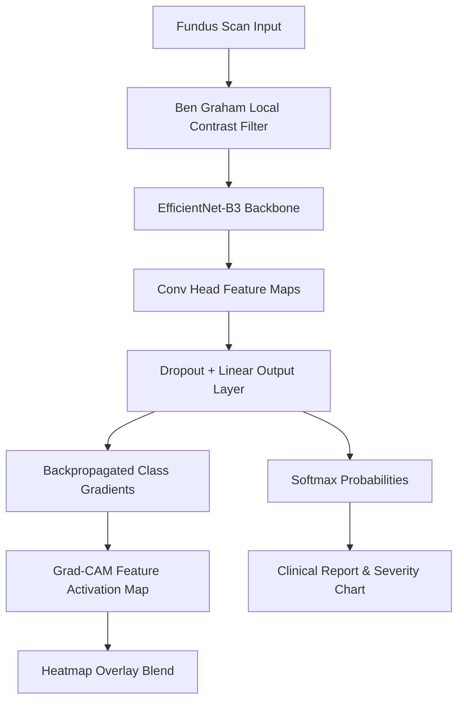

# RetinaScan AI: Explainable Diabetic Retinopathy Diagnostic System

---

## 👥 Team Details
* **Team Name**: [Insert Team Name]
* **Team Members**:
  * [Member 1 Name] - [Role/Registration No.]
  * [Member 2 Name] - [Role/Registration No.]
  * [Member 3 Name] - [Role/Registration No.]
* **Institution / Organization**: [Insert Name]

---

## I. Problem Statement
Diabetic Retinopathy (DR) is a microvascular complication of diabetes mellitus resulting from damage to the blood vessels of the light-sensitive retina. Globally, DR remains one of the primary causes of preventable blindness in working-age adults. 

In clinical diagnostics, key challenges persist:
1. **Clinical Overhead**: Screening requires high-resolution digital fundus photographs to be manually analyzed by ophthalmologists. The ratio of specialists to patients is critically low in developing regions, delaying screening pipelines.
2. **Asymptomatic Early Stages**: Early-stage retinopathy (Mild to Moderate NPDR) is frequently asymptomatic, making automated detection vital for timely intervention before irreversible vision loss occurs.
3. **The "Black Box" Interpretability Gap**: Standard convolutional neural networks function as uninterpretable predictors. Clinicians require visible reasoning overlays (such as lesion identification and activation maps) to trust automated diagnostic tools.

---

## II. Objective
The goal of this project is to build an end-to-end explainable medical computer vision system that:
1. Classifies fundus photographs into the five official severity levels of Diabetic Retinopathy.
2. Applies localized image preprocessing to isolate bleeding lesions, microaneurysms, and exudates.
3. Leverages Class Activation Mapping (Grad-CAM) to overlay a focal attention heatmap indicating where the model concentrates.
4. Hosts a Next.js clinician workstation allowing manual annotations directly over scans for digital storage.

---

## III. Proposed Solution
We propose **RetinaScan AI**, an explainable diagnostic pipeline consisting of:
* **Pre-trained CNN Feature Extractor**: Fine-tuned EfficientNet-B3 network regularized with dropout and focal loss.
* **Ben Graham Preprocessing Core**: An OpenCV-driven local contrast subtraction pipeline.
* **Gradio Web API**: Serving local predictions and Grad-CAM calculations in the cloud on Hugging Face Spaces.
* **Next.js Clinician Workstation**: A modern, web-based tool incorporating annotations, comparative layout tabs, and responsive theme support.

---

## IV. Technologies Used

### Backend & Machine Learning Stack
| Component | Technology | Version / Specification |
| :--- | :--- | :--- |
| Deep Learning | PyTorch | `torch` |
| Vision Transforms | Torchvision | `torchvision` |
| Pre-trained Backbones | timm | `timm` |
| Numerical Operations | NumPy | `numpy` |
| Image Manipulation | OpenCV | `opencv-python` |
| Server Engine | Gradio | `5.49.1` |

### Frontend Console Stack
| Component | Technology | Version / Specification |
| :--- | :--- | :--- |
| Framework | Next.js | `^14.2.3` |
| Core Library | React | `^18.3.1` |
| Icons | Lucide React | `^0.379.0` |
| Styling | CSS Modules | Vanilla CSS3 (Custom Variables) |

---

## V. Dataset
The deep learning core is trained on labeled fundus photography datasets (e.g., APTOS 2019 / Kaggle DR Detection) categorized into five severity levels:

| Class Label | Severity Level | Clinical Diagnostic Indicators |
| :---: | :--- | :--- |
| **0** | No DR | Healthy retina, clear macula, and normal optic disc. |
| **1** | Mild NPDR | Early appearance of isolated microaneurysms. |
| **2** | Moderate NPDR | Widespread microaneurysms, intraretinal hemorrhages, and hard exudates. |
| **3** | Severe NPDR | Dense hemorrhages in 4 quadrants, venous beading, cotton wool spots. |
| **4** | Proliferative DR | Neovascularization (new blood vessel growth), vitreous hemorrhage. |

---

## VI. Methodology / Model Architecture



### A. Local Contrast Preprocessing (Ben Graham)
Retinal fundus images are often captured under variable lighting. We implement Ben Graham's local contrast subtraction method:
$$\text{Output} = \alpha \cdot I(x, y) + \beta \cdot (I(x, y) * G_{\sigma}(x, y)) + \gamma$$
Where $I(x, y)$ represents the source image, $G_{\sigma}(x, y)$ is a Gaussian kernel with standard deviation $\sigma=10$ scaling to size $300\times300$, and $\alpha=4, \beta=-4, \gamma=128$. This highlights structural defects (hemorrhages, exudates) and balances illumination.

### B. EfficientNet-B3 Classifier
We utilize EfficientNet-B3, which scales resolution, depth, and width uniformly using a compound coefficient. To counter severe class imbalance in the training data, we implement Class-Weighted Focal Loss:
$$\text{FL}(p_t) = -\alpha_t (1 - p_t)^\gamma \log(p_t)$$
Where $\gamma$ is the focusing parameter (default $=2.0$), and $\alpha_t$ balances class frequencies.

### C. Explaining Decisions (Grad-CAM)
We compute Grad-CAM activation maps by taking the gradients of the score for class $c$, $y^c$, with respect to the activation maps $A^k$ of the last convolutional layer:
$$w_k^c = \frac{1}{Z} \sum_{i} \sum_{j} \frac{\partial y^c}{\partial A_{i,j}^k}$$
The activation maps are weighted by $w_k^c$ and passed through a ReLU activation to construct the final heatmap:
$$L_{\text{Grad-CAM}}^c = \text{ReLU}\left(\sum_{k} w_k^c A^k\right)$$

---

## VII. Installation & Setup Instructions

### Backend Setup
1. Navigate to the project root and install python packages:
   ```bash
   pip install -r requirements.txt
   ```
2. Start the local Gradio backend:
   ```bash
   python app.py
   ```

### Frontend Setup
1. Install Node modules:
   ```bash
   npm install
   ```
2. Start the Next.js development server:
   ```bash
   npm run dev
   ```
3. Open [http://localhost:3000](http://localhost:3000) in your browser.

---

## VIII. Usage Instructions
1. Open the clinician console at `http://localhost:3000`.
2. Drag and drop a fundus photograph into the upload dropzone.
3. Optionally toggle **Annotate Mode** to circle or draw clinical annotations on the image.
4. Click **Compute Diagnostic Assessment**.
5. Observe the predictions chart and clinical signs text on the right panel.
6. Toggle the **Preprocessed View** and **AI Grad-CAM** tabs below the image to review local contrast enhancements and AI feature map highlights.

---

## IX. Results and Outputs

### Case 1: Proliferative Diabetic Retinopathy (PDR)
Below is the system console output for a case diagnosed with Proliferative DR. The preprocessed view highlights dense microaneurysms and abnormal vessel networks:


### Case 2: Normal Retina (No DR)
Below is the output for a healthy retina. The preprocessed view reveals clear macular areas, uniform vessel maps, and zero hemorrhages:


---

## X. Future Scope
1. **Lesion Segmentation Integration**: Implementing a U-Net head alongside the classifier to produce pixel-level segmentation masks for microaneurysms and hard exudates.
2. **Automated Patient Report Generation**: Exporting clinical observations, drawings, and model confidence scores into standardized PDF reports.
3. **Cloud Synchronization**: Connecting the annotation database with local hospital Electronic Health Record (EHR) networks using FHIR standards.

---

## XI. References
1. M. Tan and Q. V. Le, "EfficientNet: Rethinking Model Scaling for Convolutional Neural Networks," *International Conference on Machine Learning*, 2019.
2. R. R. Selvaraju et al., "Grad-CAM: Visual Explanations from Deep Networks via Gradient-based Localization," *IEEE International Conference on Computer Vision*, 2017.
3. Tsung-Yi Lin et al., "Focal Loss for Dense Object Detection," *IEEE Transactions on Pattern Analysis and Machine Intelligence*, 2017.
