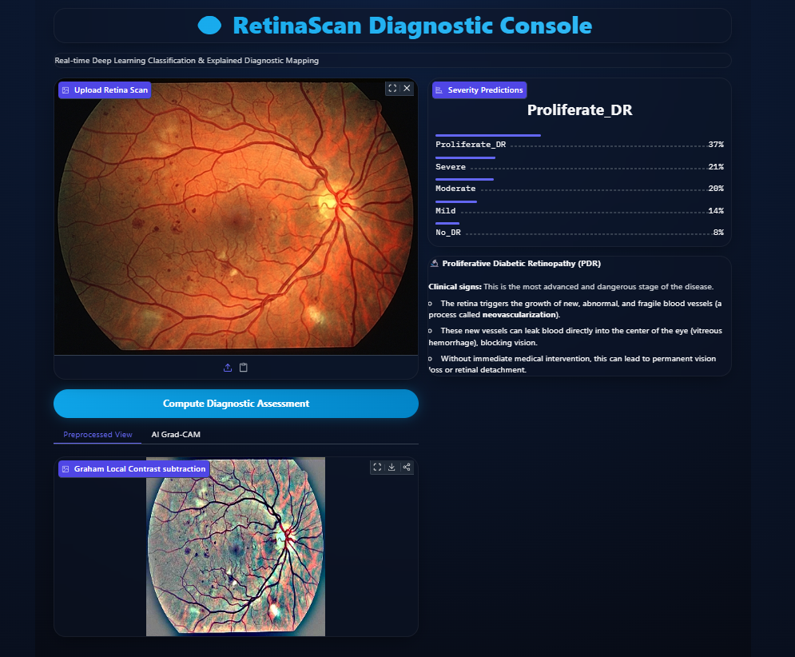
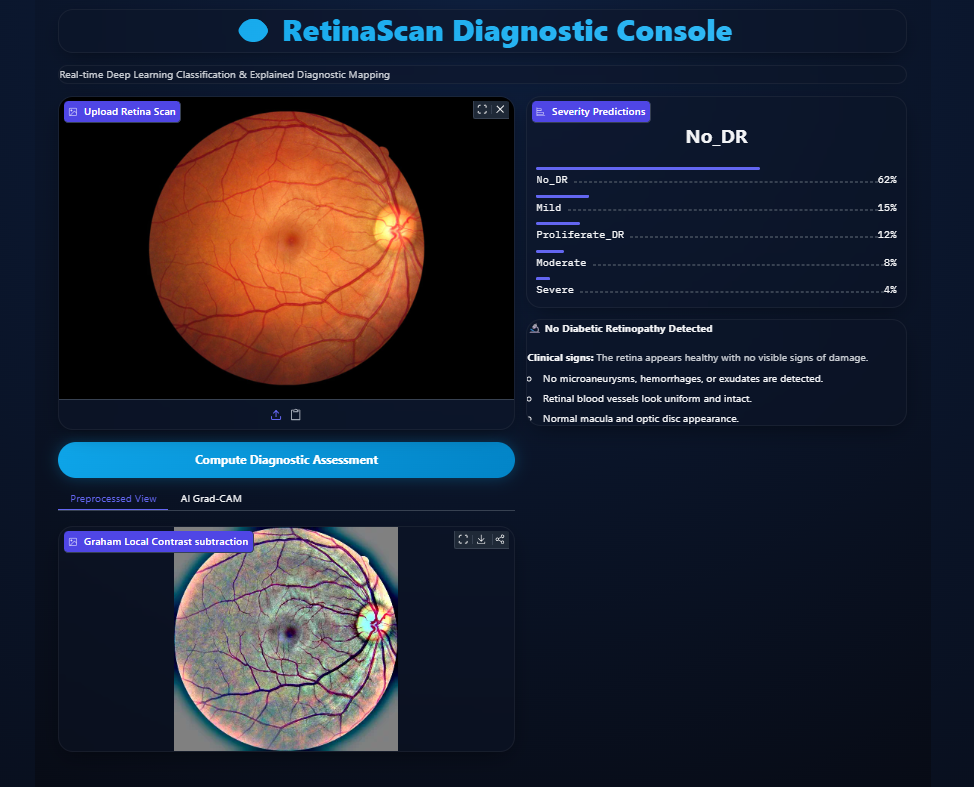

# 👁️ Diabetic Retinopathy Classification System

### 🌐 Live Web Demo: [Hugging Face Space](https://huggingface.co/spaces/venmugilrajan/Diabetic_Retinopathy)

An end-to-end deep learning pipeline to classify Diabetic Retinopathy severity from retinal fundus images using PyTorch, EfficientNet-B3, Focal Loss, and a premium Next.js dashboard + Gradio console.

---

## 📁 Project Structure

```
├── src/                              # Next.js App Router codebase
│   └── app/                          # Main pages, layouts, and API routes
├── diabetes-re/                      # Labeled Retina Dataset (Ignored in Spaces)
│   ├── train.csv                     # Image names & diagnoses
│   └── colored_images/               # Preprocessed image subfolders
├── code.ipynb                        # EDA, Preprocessing, Training & Evaluation Notebook
├── app.py                            # Gradio Web Server Dashboard interface (Space app file)
├── best_diabetic_retinopathy_model.pth # Saved model weights checkpoint
├── requirements.txt                  # Python dependencies list
├── package.json                      # Next.js configuration and dependencies
├── next.config.js                    # Next.js bundler settings
└── README.md                         # Project documentation
```

---

## 📊 Model Performance & Metrics

The deep learning model is built using an **EfficientNet-B3** backbone fine-tuned on the APTOS 2019 / Kaggle DR dataset. To combat significant class imbalances, the training utilizes a Class-Weighted Focal Loss function.

### 📈 Training Progress Summary
* **Final Epoch (Epoch 15)**:
  * **Training Accuracy**: 72.87%
  * **Validation Accuracy**: 72.54%
  * **Validation Loss**: 0.2603

### 📋 Classification Report (Validation Set)
The model achieves an overall **accuracy of 71%** across 5 classification levels:

| Diagnosis Class | Severity Level | Precision | Recall | F1-Score | Support |
| :--- | :--- | :---: | :---: | :---: | :---: |
| **Class 0** | No DR | 0.97 | 0.93 | 0.95 | 364 |
| **Class 1** | Mild NPDR | 0.34 | 0.62 | 0.44 | 58 |
| **Class 2** | Moderate NPDR | 0.82 | 0.40 | 0.54 | 211 |
| **Class 3** | Severe NPDR | 0.34 | 0.78 | 0.47 | 49 |
| **Class 4** | Proliferative DR | 0.34 | 0.42 | 0.38 | 50 |
| **Average / Total** | | | | | |
| **Accuracy** | | | | **0.71** | 732 |
| **Macro Average** | | 0.56 | 0.63 | 0.56 | 732 |
| **Weighted Average** | | 0.79 | 0.71 | 0.72 | 732 |

---

## 🖼️ Results and Outputs

### Case 1: Proliferative Diabetic Retinopathy (PDR)
Below is the system console output for a case diagnosed with Proliferative DR. The preprocessed view highlights dense microaneurysms and abnormal vessel networks:



### Case 2: Normal Retina (No DR)
Below is the output for a healthy retina. The preprocessed view reveals clear macular areas, uniform vessel maps, and zero hemorrhages:



---


## 🎨 Premium Features

1. **Dual Premium Modes**: Elegant transition between dark cyber-obsidian and glassmorphic light theme presets.
2. **Clinician Annotation Canvas**: Real-time canvas sketching directly overlaying the fundus photograph to draw lesion boundaries.
3. **Graham Preprocessed View**: Gaussian blur subtraction technique sharpening vascular profiles side-by-side with original photos.
4. **AI Grad-CAM Heatmapping**: Neural network activation map highlighting visual points of interest.

---

## 🛠️ Setup & Installation

### 1. Python ML Backend
1. Install dependencies:
   ```bash
   pip install -r requirements.txt
   ```
2. Run the local backend server:
   ```bash
   python app.py
   ```
   Open `http://127.0.0.1:7860` to access the local Gradio interface.

### 2. Next.js Web Dashboard
1. Install node dependencies in the root folder:
   ```bash
   npm install
   ```
2. Launch the local development server:
   ```bash
   npm run dev
   ```
3. Open [http://localhost:3000](http://localhost:3000) in your browser.

---

## 🚀 Hosting & Deployment

### 1. Hugging Face Spaces (Backend)
- This directory is configured with Gradio space frontmatter metadata. 
- Create a Gradio Space on Hugging Face and push `app.py`, `requirements.txt`, and `best_diabetic_retinopathy_model.pth` to run the model 24/7.

### 2. Vercel (Next.js Frontend)
1. Push your repository to GitHub.
2. Link your repository to a new project in [Vercel](https://vercel.com/).
3. Vercel will automatically build and deploy your Next.js application at a public link.
4. Click the gear icon (`⚙️`) in your website's header to save your Hugging Face Space path (e.g. `venmugilrajan/Diabetic_Retinopathy`) so your Vercel frontend automatically connects to the model in the cloud!
